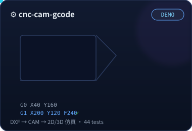
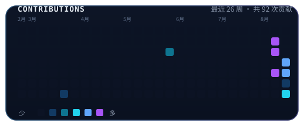

 

**天漠雪佳** · `TmxjTmxj`

用 AI Agent 造东西的工程师 — 智能制造 · 具身智能 · 工业软件

---

## 🧭 我在做什么

  

---

## 🎬 项目演示

  
  
  

---

## 📊 GitHub 数据

  

  

---

## 🛠 技术栈

  
  
  
  
  
  
  
  

---

## 🚀 主打作品

  

### 🏭 [cnc-cam-gcode-simulator](https://github.com/TmxjTmxj/cnc-cam-gcode-simulator)
**CNC CAM 与 G 代码仿真软件** — DXF 导入 → CAM 刀路 → Fanuc G 代码 → 2D/3D 仿真，车铣双模式独立桌面软件。`44 tests ✅` `4000+ 行`

### 💉 [microneedle-skin-pullout](https://github.com/TmxjTmxj/microneedle-skin-pullout)
**自锁微针穿刺仿真** — Abaqus/Explicit 端到端由 Codex 经 MCP 自动化完成，支撑发明专利。`0.18N 峰值力-位移曲线` `真实工程报告`

### 🎯 [agent-orchestrator](https://github.com/TmxjTmxj/agent-orchestrator)
**轻量多 Agent 编排框架** — plan → delegate → execute → collect，6 角色 + 并行执行 + 失败隔离。

---

## 🧠 Agent 生态

| 项目 | 一句话 |
| :--- | :--- |
| [hermes-core](https://github.com/TmxjTmxj/hermes-core) | Agent 意识引擎 + 四层记忆 + 跨 Agent 记忆桥 |
| [lobster-core](https://github.com/TmxjTmxj/lobster-core) | Agent 技能工厂 + 学习循环 + 技能编排注册 |
| [tmxj-agent](https://github.com/TmxjTmxj/tmxj-agent) | Rust 编码 Agent，日常主力工具 |
| [hermes-obsidian-vault](https://github.com/TmxjTmxj/hermes-obsidian-vault) | 基于 Obsidian 的三层知识管道 |
| [pi-agent-omnipotent](https://github.com/TmxjTmxj/pi-agent-omnipotent) | TypeScript 通用 Agent，多场景调度 |
| [software-dev-team-skill](https://github.com/TmxjTmxj/software-dev-team-skill) | Agent 虚拟团队 SOP — PM / 架构 / 开发 / QA |

## 🏭 工业仿真

| 项目 | 领域 | 成果 |
| :--- | :--- | :--- |
| [ansys-mech-sim-cases](https://github.com/TmxjTmxj/ansys-mech-sim-cases) | 涡轮叶片 / 轴承 / 缸筒 | 26 张仿真图 + 工程报告 |
| [shrapnel-force-predictor](https://github.com/TmxjTmxj/shrapnel-force-predictor) | 弹片力值预测 | 7 种 ML 回归，误差 3.72% |
| [beifeng-wind-agent](https://github.com/TmxjTmxj/beifeng-wind-agent) | 风电运维 RAG Agent | 评测得分率 99.3%（604/608） |
| [G-code-simulation](https://github.com/TmxjTmxj/G-code-simulation) | G 代码仿真（早期） | 第一版 |

## 🎮 彩蛋

| 项目 | 一句话 |
| :--- | :--- |
| [electronic-muyu](https://github.com/TmxjTmxj/electronic-muyu) | 电子木鱼微信小程序 — 敲一敲涨功德 |
| [cat-cradle-checker](https://github.com/TmxjTmxj/cat-cradle-checker) | 猫摇篮检查器 |

---

## 🏅 资产

> **发明专利** · 自锁微针（穿刺仿真支撑）
> **软件著作权** · CAM 仿真软件
> **15+ Agent 系统** · MCP 工业软件 · 赛题级 ROS2 框架

---

## 🧭 正在做的方向

- [ ] **Agent 控制 ROS2 机器人** —— MCP + Gazebo 仿真，让 Agent 真的进车间
- [ ] **Agent 内核** —— 分层记忆 / 意识引擎（Hermes / Lobster）
- [ ] **智能工业落地** —— CAD / CAE / CAM 自动化

---

> **寂轨生新绿，旧树矮旧人。**
>
> 代码是 Agent 写的，但每一行判断，都来自我。

从山东荣成的一台电脑开始 · 正在走向 Agent 进车间的那一天

 

